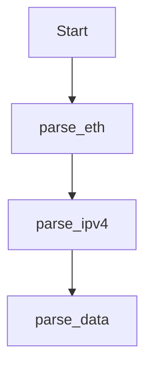

## Current Struct header 
*Header*
- ethernet 
- ipv4 
- data (25 int numbers)

## Parser Logic 

```mermaid
graph TD
    A[Start] --> B[parse_eth]
    B --> C[parse_ipv4]
    C --> D[parse_data]
```
